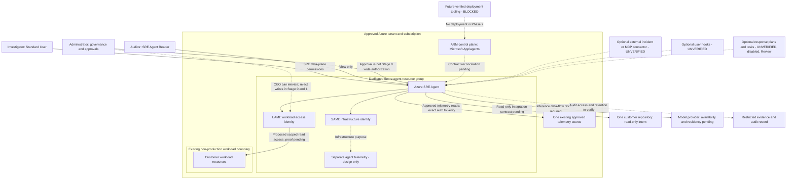

# Architecture and Trust Boundaries

Status: proposed starter architecture, not a deployed or tested system.
Evidence baseline: [Phase 1 discovery](phase-1-discovery.md), 2026-10-09.
Complete [prerequisites](01-prerequisites.md) and have a reviewer use
[security and governance](04-security-and-governance.md) before any future lab.

## Minimum Design

The starter isolates the future agent infrastructure from an existing
non-production workload. It adds no new workload telemetry by default. One
approved repository and one existing telemetry source keep the first evidence
boundary understandable. Model/provider availability and authentication details
are not selected or implied by this diagram.

Arrows describe intended responsibilities, not API calls or verified network
routes. The OBO arrow represents authorization risk, not a literal token
exchange with the UAMI. Telemetry can reside outside the workload RG and then
requires its own approved scope. The diagram is not evidence of private
connectivity, audit export support, or model residency.

For each optional node (external integrations, hooks, response plans/tasks):
**Optional placeholder requiring validation against current Azure SRE Agent documentation.**
Agent telemetry placement and audit collection mechanics are also design-only;
their resource and permission requirements must be verified before implementation.

## Components and Ownership

| Component | Mandatory/optional for future foundation | Owner / intended role | Resources changed in Phase 2 | Future evidence required |
| --- | --- | --- | --- | --- |
| Agent RG and `Microsoft.App/agents` | Mandatory, future | Platform creates RG; scoped deployer manages approved infrastructure | None | Exact IDs, supported API and property contract, cost approval |
| SAMI | Mandatory in documented creation flow | Infrastructure access only | None | Principal ID and exact infrastructure grants; no workload-role leakage |
| UAMI | Mandatory for workload access | Scoped Azure reads and supported connector authentication | None | Principal ID, role inventory including inheritance, no write elevation |
| Existing workload RG | Mandatory | Workload owner retains lifecycle and incident authority | None | Explicit resource boundary; unrelated services excluded |
| Existing telemetry source | Mandatory | Data owner authorizes bounded reads | None | Current telemetry, approved query scope, retention and sensitivity |
| Existing repository | Mandatory input to starter design | Repository owner authorizes code access | None | Pinned supported connector/auth contract and read-only tool exposure |
| Agent telemetry/audit evidence | Mandatory observability objective; mechanics pending | Platform/security own retention and access | None | Separate ownership, redaction, query access, and verified audit coverage |
| Model/provider | Mandatory future decision, no default selected | Platform, security, privacy, cost owners | None | Subscription/region eligibility, processing boundaries, cost model |
| Incident, notification, MCP, hook, task extensions | Optional, unverified | Integration owner plus security reviewer | None | Schemas, effective tool permissions, negative tests and rollback |

## How a Future Investigation Should Work

This is a review scenario, not instructions to run an agent now.

1. **Establish context:** the investigator records approved resource IDs and a
   bounded incident time window. Permission: SRE Agent Standard User for future
   chat plus approved source access. Evidence: scope and incident reference.
2. **Collect approved reads:** the agent uses its UAMI for workload access and
   verified authentication for the telemetry/repository sources. Evidence:
   resource IDs, timestamps, redacted query results, and source references.
   Existing telemetry is not proof that every required table is accessible.
3. **Form a diagnosis:** separate observed facts, assumptions, and uncertainty.
   Evidence: a competing hypothesis and the read-only check that could disprove
   the leading hypothesis. A model answer without sources is not sufficient.
4. **Recommend only:** write the proposed change, expected impact, human owner,
   and rollback requirement. Stage 0/1 performs no Azure or external writes.
   Deny OBO write authorization; no Admin approval may bypass this kit policy.
5. **Review and retain:** the workload owner validates the diagnosis; the audit
   reviewer retains minimal redacted evidence. Retention/export implementation
   must be proven, not assumed from a portal thread.

**Resources changed:** no workload or external system changes are allowed by
this scenario; a future run can create agent threads/operational records and
incur usage charges. Strict "read-only" describes target-resource effects,
not zero internal records or free execution. **Common failures:** missing logs,
stale code, wrong identity, inherited writes, overbroad connector, or a denied
tool. **Recovery:** stop, preserve evidence, repair the approved read boundary
through the owner; do not grant broad Contributor or authorize OBO writes.

## ARM Versus Data Plane

The versioned ARM resource reference lists `Microsoft.App/agents@2026-01-01`.
The API guide has `2025-05-01-preview` examples. The IaC guide documents an
ARM/data-plane split, while the API guide's hook sub-resource description
conflicts with the IaC guidance. A configuration envelope does not validate
the inner hook/connector/schedule schema.

| Surface | Evidence | What is not established |
| --- | --- | --- |
| Base resource | 2026-01-01 ARM reference, identity and properties | Parity with preview template/API examples and onboarding side effects |
| Modes | ARM `ReadOnly`/`Review`/`Autonomous`; run-mode guide per-task/per-plan options | Safe mapping across current resource and automation contracts |
| Release channel | ARM `Stable`/`Preview` | Stable channel does not make every configuration API non-preview |
| Human role contract | Current user-role guide defines four personas | API guide's older role/approval terminology; actual deployed definitions |
| Hooks/connectors/plans/tasks | Conceptual and preview implementation guidance | Verified request/response schemas, runtime enforcement and failure behavior |
| IaC backends | Bicep and AzAPI are documented | Native Terraform SRE resource or working kit deployment |

Future Bicep is primary, with AzAPI only where the same verified contract is
supported. An azd wrapper, if later adopted, does not bypass those gates.
No payloads, endpoints, scripts, or empty deployment stubs are provided here.
Future `config/dev.json`, `config/test.json`, and `config/prod.json` belong to
the kit; they are not a product data-plane format.

## Architecture Review Steps

1. **Mandatory:** draw the actual workload and telemetry boundaries using full
   resource IDs. Evidence: workload/data-owner approval. Permissions: existing
   read visibility or owner exports. Changes: diagram only.
2. **Mandatory:** mark each identity and credential owner. Evidence: proposed
   role scopes, lifecycle, and later exact principal IDs. Permissions: IAM
   reviewer involvement; no new grants now. Changes: record only.
3. **Mandatory:** trace code, logs, prompts, model inference, and outputs across
   trust boundaries. Evidence: approved data categories, residency, retention,
   and external service agreements. Changes: privacy review only.
4. **Mandatory:** compare product defaults and all privilege paths to Stage 0/1.
   Evidence: disabled/Review intent plus open permission/approval gate list.
   Changes: no policy installation now; broad Allow hooks are excluded.
5. **Optional:** add one extension at a time using the exact placeholder label.
   Evidence: named validation owner, schema source, scope, cost, and rollback
   plan. Changes: proposal only. Unknown behavior is not an accepted baseline.
6. **Mandatory:** record the decision and unresolved gates in the
   [decision log](decision-log.md). No live readiness claim without a disposable
   authorized lab and negative-test evidence.

**Rollback:** remove only proposed optional nodes or withdraw a document
decision. No Azure cleanup is needed here. A future agent recreation for a
region move requires separate approval and inventory; preserve customer-owned
workload, repository, and telemetry resources.

## Costs, Privacy, and Design Limits

One home region is not a multi-region architecture. Moving an agent requires
recreation. Inference may leave the selected region and external connectors
introduce additional data destinations. Private endpoints, single-active-incident
limits, data-plane OIDC compatibility, and hook fail-closed behavior are not
verified by Phase 1 and must not be claimed as working capabilities or limits.

Fixed and variable agent charges, telemetry ingestion/retention, model usage,
and external infrastructure/service fees need separate estimates. Do not copy
rates into a timeless architecture diagram. Stopping is not a zero-cost control;
a budget notification is not an enforced cap.

## Official Sources

See [Phase 1 source ledger and conflicts](phase-1-discovery.md),
[overview](https://learn.microsoft.com/en-us/azure/sre-agent/overview),
[creation](https://learn.microsoft.com/en-us/azure/sre-agent/create-and-set-up),
[permissions](https://learn.microsoft.com/en-us/azure/sre-agent/permissions),
[deploy with IaC](https://learn.microsoft.com/en-us/azure/sre-agent/deploy-iac),
[API guide](https://learn.microsoft.com/en-us/azure/sre-agent/api-reference),
[ARM 2026-01-01](https://learn.microsoft.com/en-us/azure/templates/microsoft.app/2026-01-01/agents),
[pricing](https://learn.microsoft.com/en-us/azure/sre-agent/pricing-billing), and
[privacy](https://learn.microsoft.com/en-us/azure/sre-agent/data-privacy).